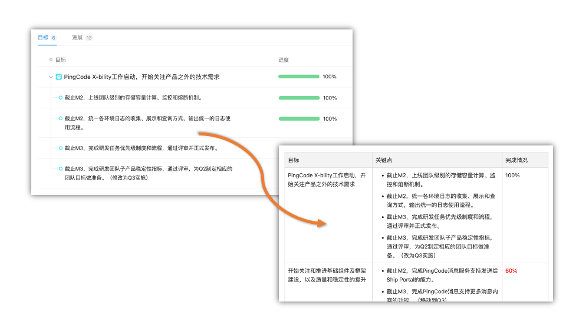

# pc-goals-exporter

方便的把PingCode Goals里面的目标、关键结果和进度导出为纯文本或Markdown格式，直接粘贴到述职的Wiki页面里面，不用手动复制了。 🐶

用法

1. 登录对应的PingCode团队，下载Cookies文件。可以使用[Get Cookies.txt](https://chrome.google.com/webstore/detail/get-cookiestxt/bgaddhkoddajcdgocldbbfleckgcbcid)这个Chrome Extension。假设我们将输出的`pingcode.com_cookies.txt`保存在当前运行目录下。
1. 在PingCode Goals里面打开「目标」下要导出的用户和周期，从URL中复制`periods`的ID（譬如`61a9cfe155ecfc287c5ff950`）和`followers`的UID（譬如`c01a95b2898c4f339ef80befbca2f037`）。
1. 执行如下命令将此周期的目标、关键点和完成度以Markdown格式输出到控制台。`./pc -p 61a9cfe155ecfc287c5ff950 -u c01a95b2898c4f339ef80befbca2f037 -r -c ./pingcode.com_cookies.txt -o markdown`

命令行参数

| 参数 | 类型 | 说明 | 默认值 |
| :---: | :---: | :--- | :--- |
| -c | string | Cookies文件路径 | |
| -h | string | PingCode访问地址 | at.pingcode.com |
| -o | string | 输出格式：markdown、text | text |
| -p | string | 周期ID | |
| -u | string | 用户的UID | |
| -r | boolean | 是否输出目标完成度 | |